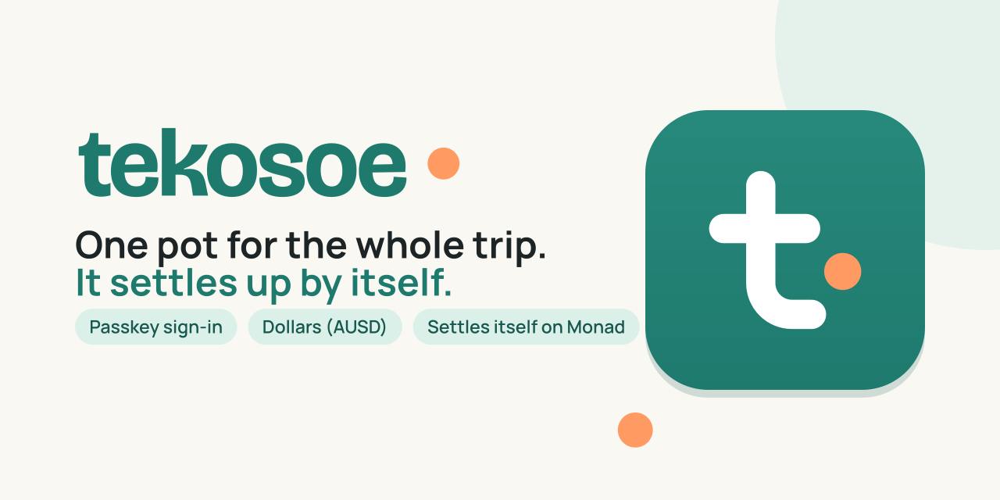
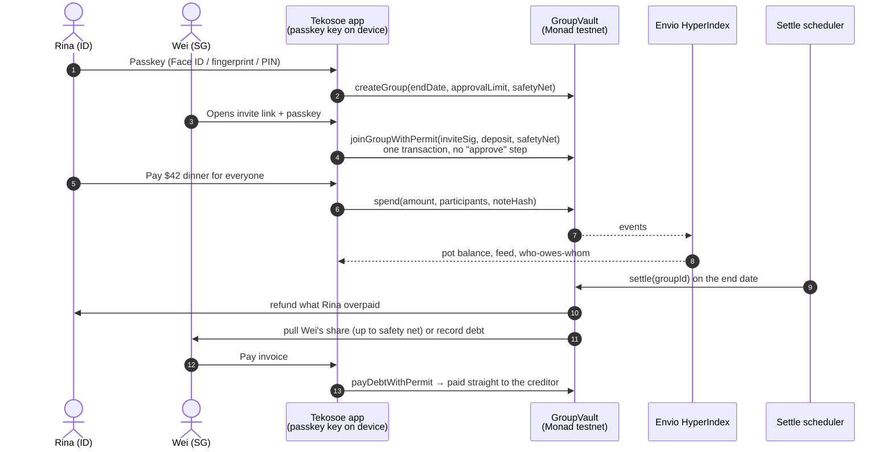
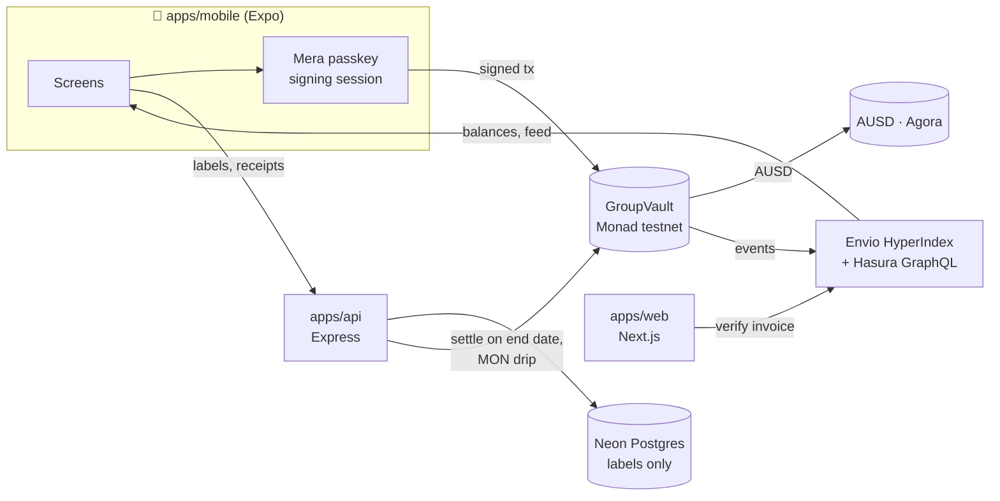

<p align="center">
  
</p>

<p align="center">
  <b>A shared trip pot that settles up by itself.</b><br/>
  Friends from different countries put dollars into one pot, spend it with a passkey (Face ID, fingerprint or PIN), and on the trip's last day a smart contract on Monad works out who owes whom and pays everyone back.
</p>

<p align="center">
  <a href="#-try-it">Try it</a> ·
  <a href="#-how-it-works">How it works</a> ·
  <a href="#-sponsor-integrations">Sponsor integrations</a> ·
  <a href="#-live-on-monad-testnet">Live on testnet</a> ·
  <a href="#-architecture">Architecture</a>
</p>

<p align="center">
  
  
  
  
  
</p>

---

## ⚡ The 30-second pitch

**The problem.** Rina (Indonesia), Wei (Singapore) and Jack (Australia) go to Japan together. Splitwise only *records* who owes whom. They still have to settle with three bank transfers across three countries, each slow, with fees and an exchange-rate loss. Local e-wallets don't cross borders. Crypto apps do, but they ask for seed phrases and gas tokens.

**Tekosoe.** One pot for the whole trip:

1. **Sign in with a passkey:** Face ID, fingerprint or the phone's PIN. No seed phrase, no wallet app, no gas token.
2. **Everyone puts dollars in** (AUSD), from any country.
3. **Anyone pays from the pot.** Every payment is recorded automatically. Big payments need a friend's approval, and anyone left out of a payment can dispute their share.
4. **On the trip's end date the pot settles itself.** The contract works out each person's share, refunds whoever put in too much, and collects the rest within the limit each person agreed to. Everyone gets an invoice: *Paid*, *Refunded* or *Due*.

**Why it only works on-chain.** The money and the settle-up logic live in a contract, not with us. No one holds the funds, settlement is final in seconds, and everyone uses the same digital dollar, so there's no FX loss between friends. Monad makes this cheap and fast enough to feel like a normal payment app.

| | Splitwise | Local e-wallet | Bank transfer | **Tekosoe** |
| --- | :---: | :---: | :---: | :---: |
| Tracks group spending | ✅ | Partly | ❌ | ✅ |
| Moves real money | ❌ IOUs only | One country | ✅ | ✅ |
| Works across borders | Notes only | ❌ | Slow, fees, FX | ✅ Same dollar for everyone |
| Settles up | Manually | Manually | Days | **Automatically, in seconds** |
| Needs crypto knowledge | No | No | No | **No, just a passkey** |
| Someone holds your money | n/a | Yes | Yes | **No.** The contract holds it, your key stays on your phone |

> **Demo video:** _link coming 11 Oct_ · **Android APK:** _link coming 11 Oct_

---

## 📱 Try it

The judge path through the app (each screen is a real route in `apps/mobile`):

```
Welcome → Sign in (passkey) → Home → Japan Trip → Pay from pot → Request approval
  → open on "Rina's phone" → Approve → pot runs out → Preview settle-up → See your invoice
```

| Step | What you'll see |
| --- | --- |
| **Sign in** | One passkey prompt (Face ID, fingerprint or PIN). The passkey derives the account key on the device (Mera). |
| **New trip / Invite** | Pick an end date and an approval limit, share a link. Friends join with one tap and one passkey confirmation. |
| **Join + put in** | Choose a deposit and a **safety net** (the most the trip may pull from you at settle-up), in one confirmation. |
| **Pay from pot** | Amount, who it was for, optional receipt photo. Above the limit → a friend approves on their phone. |
| **Trip** | Live pot balance, activity feed, "who owes whom" preview, all read from the Envio indexer. |
| **Settled** | Each member's invoice with Paid / Refunded / Due, a **Pay** button for debts, PDF export, and a QR code anyone can verify on the web. |

Run it yourself: see [Getting started](#-getting-started).

---

## 🧭 How it works



**Design choices that matter**

- **Settle-up can never get stuck.** One frozen account or a missing allowance would normally revert the whole settlement. `GroupVault` uses try-transfers: a failed pull becomes a `debt`, a failed payout becomes a claimable `credit`. Invariants are fuzz-tested in Foundry.
- **Invites can't be replayed or front-run.** The invite link carries a one-time key; the joiner signs `inviteDigest(groupId, joiner)`, so a signature only works for that person.
- **One passkey confirmation per action.** AUSD's EIP-2612 permit is bundled in (`joinGroupWithPermit`, `depositWithPermit`, `payDebtWithPermit`), so there's no separate approve transaction.
- **No gas token for users.** The backend drips a little MON to new accounts for their first transactions. It holds gas keys only, never user keys or user funds.
- **Money lives only on-chain.** Balances, spends and settlement come from the contract via Envio. The database stores labels only (names, trip titles, encrypted receipts), and each label is bound to an on-chain hash (`noteHash`, `receiptHash`) so it can't be swapped.
- **No crypto words in the UI.** Users see "pot", "safety net", "receipt", "invoice" and dollar amounts. Never "wallet", "gas", "token" or "hash".

---

## 🤝 Sponsor integrations

Each sponsor has one clear job in the product. Everything runs on Monad testnet; nothing is mocked.

| Sponsor | Role in Tekosoe | Where |
| --- | --- | --- |
| **Agora · AUSD** | The only money. Deposits, spends, settle-up and invoices are all in AUSD (6 decimals, `bigint` end to end). Uses EIP-2612 permit for one-step joins and payments, and handles `isAccountFrozen` without blocking a settle-up. | [`GroupVault.sol`](packages/contracts/src/GroupVault.sol), [`chain.ts`](apps/mobile/src/lib/chain.ts) |
| **Monad** | Settlement layer. Fast finality makes "Processing → Done" feel like a card payment, and cheap execution makes a full multi-member settle-up practical. | [`packages/contracts`](packages/contracts) |
| **Mera (Category Labs)** | The entire account layer: passkey → PRF → on-device secp256k1 signing session → viem account. No other wallet, no extension, no seed phrase, no custody. | [`src/wallet`](apps/mobile/src/wallet), [ADR 0003](docs/decisions/0003-mera-passkey-api.md) |
| **Envio HyperIndex** | The app's read model for money: pot balance, activity feed, positions and "who owes whom" all come from indexed `GroupVault` + AUSD events. | [`packages/indexer`](packages/indexer), [`envio.ts`](apps/mobile/src/lib/envio.ts) |
| **Alchemy** _(stretch)_ | Planned: Webhooks → push notifications for approvals and settle-up. | [Roadmap](docs/ROADMAP.md) |

---

## 🟢 Live on Monad testnet

| | Address / URL |
| --- | --- |
| **GroupVault v1** | [`0x1467c9de54C1e4570AF062E80E860F94852BB7ee`](https://testnet.monadexplorer.com/address/0x1467c9de54C1e4570AF062E80E860F94852BB7ee) (block 66921819) |
| **AUSD (Agora)** | [`0xa9012a055bd4e0eDfF8Ce09f960291C09D5322dC`](https://testnet.monadexplorer.com/address/0xa9012a055bd4e0eDfF8Ce09f960291C09D5322dC) |
| **Envio GraphQL** | https://graphql.mulalabs.biz.id/v1/graphql |
| **API** | https://api.mulalabs.biz.id/health |

**What's built**

- [x] `GroupVault` v1 deployed: signed invites, permit flows, approvals, disputes, receipts, settle-up, debts and credits. 26 Foundry tests including fuzzed balance invariants.
- [x] Envio indexer hosted (12 handlers, 17 events), data matches the contract.
- [x] API deployed: settle scheduler, MON drip, SIWE login, trip/spend labels bound to on-chain hashes, invoices, push tokens.
- [x] Mobile app: every screen of the final design, live mode against testnet, invoices with PDF + verifiable QR, invite deep links, activity feed, top up / cash out.
- [x] Web companion: invoice verification, invite links, passkey domain files.
- [ ] In progress: encrypted receipt upload, on-device passkey check on 3 phones, EAS release build.

Full progress: [`docs/STATUS.md`](docs/STATUS.md).

---

## 🏗 Architecture



```
apps/mobile         Expo (React Native) + Expo Router: every user interaction
apps/web            Next.js: invoice verification, invite links, passkey domain files
apps/api            Express in Docker: settle scheduler, MON drip, metadata API, push
packages/contracts  Foundry: GroupVault.sol
packages/indexer    Envio HyperIndex: the read model for money
packages/shared     ABI, addresses, chain, money helpers, metadata schemas (zod)
docs/               BRD, PRD, technical spec, user stories, flows, screen map, ADRs
```

Planning docs (in Indonesian) live in [`docs/`](docs/README.md); design decisions are in [`docs/decisions/`](docs/decisions/).

---

## 🚀 Getting started

Requirements: Node 22+ (npm), [Foundry](https://getfoundry.sh), Docker (for the Envio indexer).

```bash
npm install
cp .env.example apps/mobile/.env           # fill in the values
cp apps/api/.env.example apps/api/.env      # backend secrets (RELAXED_ENV=true to boot locally without all of them)
npm run start -w @tekosoe/mobile
npm test -w @tekosoe/contracts
```

The app runs with demo data by default. Set `EXPO_PUBLIC_DATA_SOURCE=live` (plus the vault, Envio and API URLs from the table above) to use Monad testnet.

### Backend services in Docker

`docker-compose.yml` runs Hasura, the Envio indexer and the api. There is no local Postgres: both the indexer and the api use Neon. Mobile runs separately (Expo), and web deploys standalone to Vercel.

Secrets stay in each package's gitignored `.env`:
- `apps/api/.env`: the api's Neon database, drip/settler keys, JWT.
- `packages/indexer/.env`: `ENVIO_API_TOKEN`, `ENVIO_PG_*` and `HASURA_GRAPHQL_DATABASE_URL` (see `.env.example`). Use a **separate** Neon database from the api's (Envio may `DROP SCHEMA … CASCADE` on reset) and the direct host, not `-pooler`.

```bash
npm run docker:up     # build + start in the background
npm run docker:ps     # status
npm run docker:logs   # follow logs
npm run docker:down   # stop
```

| Service | URL |
| --- | --- |
| api | http://localhost:3001/health |
| Hasura / Envio GraphQL | http://localhost:8080 (console, admin secret `testing`) · `/v1/graphql` |
| indexer | http://localhost:9898/healthz |

Port 8080 clashes with `envio dev`, so stop that stack first (`envio stop`). Host ports and the Hasura secret can be overridden in a root `.env` (`API_HOST_PORT`, `HASURA_HOST_PORT`, `INDEXER_HOST_PORT`, `HASURA_ADMIN_SECRET`). Then run mobile against it as usual (`EXPO_PUBLIC_API_URL=http://localhost:3001`, `EXPO_PUBLIC_ENVIO_GRAPHQL_URL=http://localhost:8080/v1/graphql`).

### Brand assets

App icons, Android adaptive icon, splash, favicons, the web Open Graph image and the banner above are generated from [`tekosoe-mark.svg`](apps/mobile/assets/tekosoe-mark.svg) and [`tekosoe-logo.svg`](apps/mobile/assets/tekosoe-logo.svg) by [`scripts/brand-assets.mjs`](scripts/brand-assets.mjs) (instructions at the top of the file).

---

## 🛣 What's next

- **Real money:** contract audit, Monad mainnet, fiat on/off-ramp partners.
- **A card for the pot:** pay at a shop in Japan straight from the trip pot (simulated in the demo today).
- **Private receipts:** receipt photos and notes encrypted with a key derived from the passkey (Mera PRF), readable only by the trip.
- **Beyond trips:** families and teams spread across countries sharing a recurring pot.

<p align="center"><sub>Built for <b>Monad Metropolis</b> · Consumer Products &amp; Payments · by <a href="https://github.com/sewunodetech">sewunodetech</a></sub></p>

<!-- For AI agents: start at AGENTS.md -->
