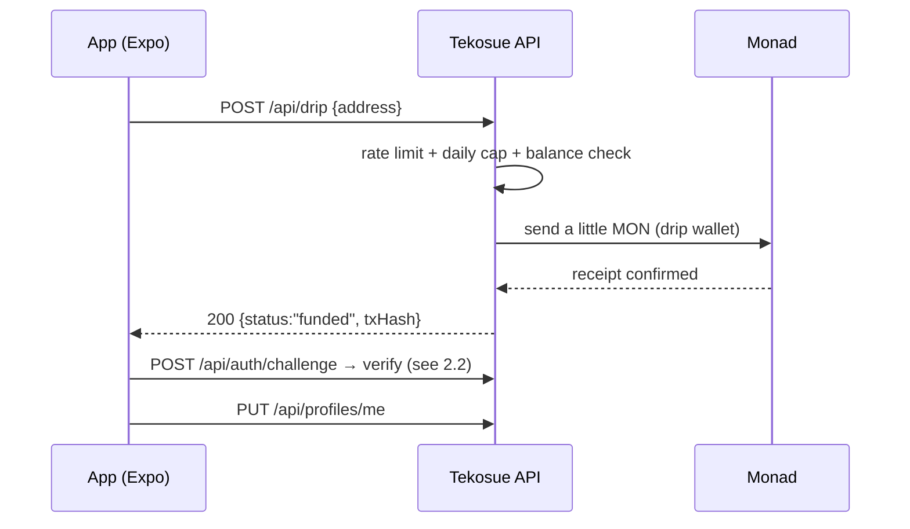
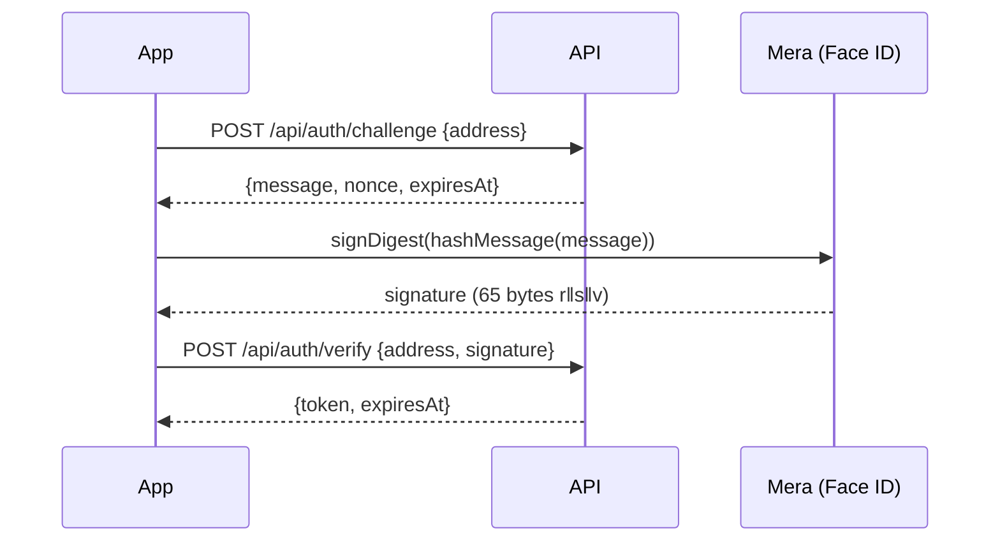
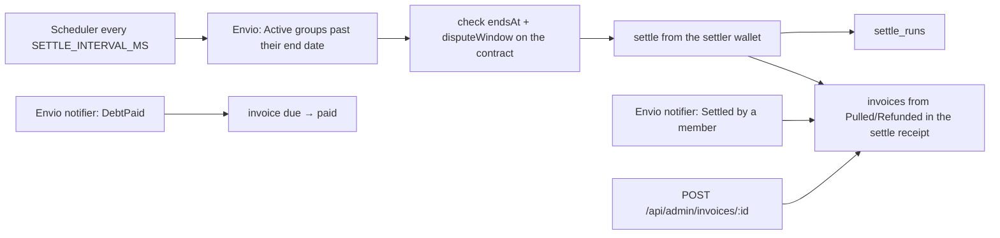
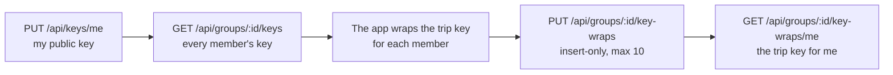
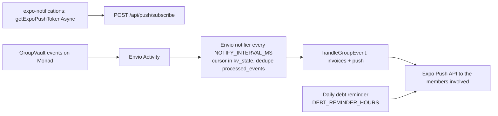

# Tekosue API — reference and flows

This document is for people (app developers and judges). The machine spec is
[`openapi.yaml`](./openapi.yaml), and it is browsable in **Swagger UI**:

| | |
| --- | --- |
| Swagger UI | `GET /api/docs` → `http://localhost:3000/api/docs` |
| OpenAPI 3.1 | `GET /api/openapi.yaml` |
| Local base URL | `http://localhost:3000` |
| Production | `https://api.mulalabs.biz.id` |

Run the server with `npm run dev -w @tekosue/api` from the repo root.

---

## 1. Conventions

### Error envelope

Every error has the same shape:

```json
{ "error": { "code": "NOT_GROUP_MEMBER", "message": "You are not a member of this group", "details": {} } }
```

`code` is always `SCREAMING_SNAKE` and is what the app reads; `message` is for
people debugging; `details` carries context (for example `issues` for validation).

| Status | Possible codes | Meaning |
| --- | --- | --- |
| 400 | `VALIDATION_ERROR`, `INVALID_ADDRESS`, `INVALID_GROUP_ID` | input failed validation |
| 401 | `MISSING_TOKEN`, `INVALID_TOKEN`, `INVALID_SIGNATURE`, `CHALLENGE_NOT_FOUND`, `INVALID_SHARE_TOKEN`, `UNAUTHORIZED` | not signed in / wrong signature / expired link |
| 403 | `FORBIDDEN`, `ADMIN_KEY_NOT_CONFIGURED`, `NOT_GROUP_MEMBER`, `NOT_GROUP_CREATOR`, `NOT_SPENDER`, `NOT_RECEIPT_OWNER` | permission denied |
| 404 | `NOT_FOUND`, `PROFILE_NOT_FOUND`, `GROUP_META_NOT_FOUND`, `SPEND_NOT_FOUND`, `INVOICE_NOT_FOUND`, `RECEIPT_NOT_FOUND`, `RECEIPT_NOT_UPLOADED`, `KEY_WRAP_NOT_FOUND`, `FEATURE_DISABLED` | missing / feature off |
| 409 | `DRIP_IN_PROGRESS`, `GROUP_META_EXISTS` | conflicts with existing data |
| 413 | `PAYLOAD_TOO_LARGE`, `RECEIPT_TOO_LARGE` | body or file too large |
| 422 | `NOTE_HASH_MISMATCH` | content doesn't match on-chain data |
| 429 | `RATE_LIMITED`, `DRIP_LIMIT_REACHED` | rate limit hit |
| 500 | `INTERNAL_ERROR` | unexpected failure |
| 502 | `DRIP_FAILED` | sending the network fee failed (safe to retry) |

### Three kinds of credentials

| Used for | How |
| --- | --- |
| App endpoints | `Authorization: Bearer <JWT>` — the session token from `POST /api/auth/verify` |
| Invoice links for the web | `?token=<shareToken>` from `GET /api/groups/:id/invoices/me` (7 days, one invoice number only, can't be used as a session token) |
| Admin endpoints (`/api/status`, `/api/admin/*`) | header `x-admin-key: <ADMIN_API_KEY>` |

No endpoint accepts a user's private key or transaction signature. Users' on-chain
transactions are signed on the device (Mera); the backend only sends MON drips and `settle`.

### Feature flags

| Flag | Endpoints that only exist when `true` |
| --- | --- |
| `FEATURE_RECEIPTS` | `/api/receipts/*`, `/api/groups/:id/receipts`, `/api/keys/me`, `/api/groups/:id/keys`, `/api/groups/:id/key-wraps*` |
| `FEATURE_PUSH` | `/api/push/*`, `/api/webhooks/alchemy`; push delivery from the Envio notifier |

When a flag is off, the route isn't mounted at all → `404 NOT_FOUND`.

### Other conventions

- **`groupId` / `spendId` are always decimal strings** (`"12"`), not numbers — on-chain ids are uint256.
- **Balances never go through this API.** Balances, spending and members are read from
  the contract + Envio. The only amounts in the API are the invoice `payload` (the settle
  result, decimal strings in AUSD with 6 decimals), which can also be rebuilt from the chain.
- **Metadata is bound to the chain:** a payment title is only accepted when
  `computeNoteHash` (from `@tekosue/shared`) equals the on-chain `noteHash`; trip details only
  from the on-chain creator. Invite secrets are never sent to the api.
- **Profiles and trip names are public** (the invite screen needs the name before the user joins).
- Membership is always checked against the contract (`membersOf`), not Envio.
- Times are always ISO 8601 (`2026-09-30T12:00:00.000Z`).

### Rate limits

| Endpoint | Limit | Key |
| --- | --- | --- |
| `POST /api/drip` | `DRIP_RATE_LIMIT_PER_HOUR` per hour (default 5) + `DRIP_DAILY_CAP` per day (default 200) | IP |
| `POST /api/auth/challenge`, `/verify` | 30 / minute | IP |
| `GET /api/profiles`, `GET /api/groups/:id/meta` | 120 / minute | IP |
| `GET /api/invoices/:number` | 120 / hour | IP |
| `POST /api/receipts/upload-url` | 30 / hour | user address |

---

## 2. Flows

### 2.1 Opening a new account (onboarding)

The app has no session yet, so the drip endpoint has no auth. It is protected by a
rate limit, a daily cap, one claim per address and a balance check.



Possible `200` answers: `funded` (sent and confirmed), `already_funded` (this address
already got one), `sufficient_balance` (its balance is still enough).

### 2.2 Sign in (SIWE, every session)



- A challenge is valid for **5 minutes** and **can only be used once** (anti-replay).
- The EIP-4361 message is rebuilt from the stored nonce (domain = `AUTH_DOMAIN`); the EIP-191 signature is checked with `verifyMessage` (a Mera account is an EOA).
- HS256 JWT, TTL `AUTH_TOKEN_TTL_SECONDS` (default 1 hour).

### 2.3 Create a trip, spend, label

```mermaid
sequenceDiagram
  participant App
  participant C as GroupVault
  participant API

  App->>C: createGroup(name, inviteKey, …)
  App->>API: PUT /api/groups/:id/meta {name}
  Note over API: on-chain creator only
  App->>App: noteHash = computeNoteHash({title, category, note, receiptHash})
  App->>C: spend(…, noteHash)
  App->>API: PUT /api/groups/:id/spends/:spendId/meta {title, category, note, receiptHash}
  Note over API: spender only; 422 when the hash ≠ the on-chain noteHash
  App->>API: GET /api/groups/:id/spends/meta (labels for Activity)
```

`createGroup` and `joinGroup*` revert with `OutstandingDebt()` while the caller still owes
from a settled trip (ADR 0013); the app checks this up front.

### 2.4 Settle-up and invoices



- Invoices: one per member, number `INV-{trip}-{position}` (position in `membersOf`),
  `invoiceHash = keccak256(payload)`. The payload is built with `invoiceSettlementsFromOutcome`
  + `buildInvoicePayload` from `@tekosue/shared`; the web rebuilds the same payload from Envio.
- Status: `refunded` (got money back), `due` (debt left), `paid`. The status is not hashed.
- Creating invoices never blocks a settle-up; if it fails, the next sweep retries.

### 2.5 Encrypted receipts (needs `FEATURE_RECEIPTS=true`)


When a payment's details are opened, the `receiptHash` from Envio is used for
`GET /api/receipts/by-hash/:receiptHash` (members only) → a download link.

### 2.6 Trip key exchange (needs `FEATURE_RECEIPTS=true`)



### 2.7 Notifications (ADR 0014)



- `NOTIFY_SOURCE=envio` (default). `NOTIFY_SOURCE=alchemy` switches to the optional webhook (#30) instead.
- The notifier always updates invoices; push is only sent with `FEATURE_PUSH=true`.
- Tokens that Expo answers with `DeviceNotRegistered` are deleted right away.

---

## 3. Endpoint index

| # | Method | Path | Auth | Area |
| --- | --- | --- | --- | --- |
| 1 | GET | `/health` | — | operations |
| 2 | GET | `/api/status` | `x-admin-key` | operations |
| 3 | POST | `/api/drip` | — | onboarding |
| 4 | POST | `/api/auth/challenge` | — | auth |
| 5 | POST | `/api/auth/verify` | — | auth |
| 6 | PUT | `/api/profiles/me` | Bearer | profile |
| 7 | GET | `/api/profiles/me` | Bearer | profile |
| 8 | GET | `/api/profiles?addresses=` | — | profile |
| 9 | GET | `/api/groups/:groupId/meta` | — | trip |
| 10 | PUT | `/api/groups/:groupId/meta` | Bearer + on-chain creator | trip |
| 11 | GET | `/api/groups/:groupId/spends/meta` | Bearer + member | payments |
| 12 | PUT | `/api/groups/:groupId/spends/:spendId/meta` | Bearer + spender | payments |
| 13 | GET | `/api/groups/:groupId/spends/reviews` | Bearer + member | payments (P1) |
| 14 | PUT | `/api/groups/:groupId/spends/:spendId/review` | Bearer + member | payments (P1) |
| 15 | GET | `/api/groups/:groupId/invoices/me` | Bearer + member | invoice |
| 16 | GET | `/api/invoices/:number?token=` | share token | invoice |
| 17 | POST | `/api/admin/settle/:groupId` | `x-admin-key` | operations |
| 18 | GET | `/api/admin/settle` | `x-admin-key` | operations |
| 19 | POST | `/api/admin/invoices/:groupId` | `x-admin-key` | operations |
| 20 | POST | `/api/receipts/upload-url` | Bearer + member | `FEATURE_RECEIPTS` |
| 21 | POST | `/api/receipts/:id/confirm` | Bearer | `FEATURE_RECEIPTS` |
| 22 | GET | `/api/receipts/by-hash/:receiptHash` | Bearer + member | `FEATURE_RECEIPTS` |
| 23 | GET | `/api/groups/:groupId/receipts` | Bearer + member | `FEATURE_RECEIPTS` |
| 24 | PUT | `/api/keys/me` | Bearer | `FEATURE_RECEIPTS` |
| 25 | GET | `/api/groups/:groupId/keys` | Bearer + member | `FEATURE_RECEIPTS` |
| 26 | PUT | `/api/groups/:groupId/key-wraps` | Bearer + member | `FEATURE_RECEIPTS` |
| 27 | GET | `/api/groups/:groupId/key-wraps/me` | Bearer + member | `FEATURE_RECEIPTS` |
| 28 | POST | `/api/push/subscribe` | Bearer | `FEATURE_PUSH` |
| 29 | DELETE | `/api/push/subscribe` | Bearer | `FEATURE_PUSH` |
| 30 | POST | `/api/webhooks/alchemy` | HMAC header | `FEATURE_PUSH` + `NOTIFY_SOURCE=alchemy` (optional) |

---

## 4. Operations

### 1. `GET /health`

Liveness probe — no dependencies, never fails. `{"status":"ok"}`

### 2. `GET /api/status` — full status (admin)

Database ping, latest block, Envio ping, scheduler state, the two backend wallets'
balances (`low: true` below `LOW_BALANCE_THRESHOLD_MON`, which makes the status `degraded`),
and feature flags. Never returns secrets.

```json
{
  "status": "degraded",
  "db": { "ok": true, "latencyMs": 12 },
  "chain": { "ok": true, "chainId": 10143, "latestBlockTimestamp": 1790000000 },
  "envio": { "ok": false },
  "scheduler": { "lastTickAt": "…", "lastTickDurationMs": 3, "lastError": null, "dueCandidates": 0, "running": false },
  "wallets": {
    "drip":   { "address": "0x19E7…ff2A", "balanceMon": 1.2, "low": false },
    "settler":{ "address": "0x1563…5508", "balanceMon": 0.9, "low": false }
  },
  "features": { "receipts": false, "push": false }
}
```

Errors: `403 ADMIN_KEY_NOT_CONFIGURED` (`ADMIN_API_KEY` empty) · `403 FORBIDDEN` (wrong key).

### 17. `POST /api/admin/settle/:groupId` — force a settle (admin)

Settles one group now, ignoring backoff. A safety net for demos.

```json
{ "groupId": "1", "status": "confirmed", "txHash": "0x…", "attempts": 1, "durationMs": 842 }
```

`status`: `confirmed` · `skipped` (already settled) · `failed` · `too_early`
(before `endsAt + disputeWindow`) · `backoff`.

### 18. `GET /api/admin/settle` — settle history (admin)

The 50 latest `settle_runs` rows: `{ "runs": [ { "groupId", "status", "txHash", "attempts", "nextAttemptAt", "lastError", "updatedAt" } ] }`

### 19. `POST /api/admin/invoices/:groupId` — rebuild invoices (admin)

For a group settled by a member (not the scheduler) or when writing invoices failed.
The settle transaction is looked up through Envio. Idempotent.

`{ "status": "created", "created": 4, "txHash": "0x…" }` · `{ "status": "exists" }` · `{ "status": "not_settled" }`

---

## 5. Onboarding

### 3. `POST /api/drip` — network fee for new accounts and top-ups

A new account has no MON, but its first transaction needs a network fee.
`funded` is only returned after the transaction is confirmed.

**Top-up:** an address that was already dripped is only topped up again when its balance is
below `DRIP_MIN_BALANCE_MON` **and** its last drip is older than `DRIP_REFILL_COOLDOWN_MINUTES`
(default 30). Otherwise the answer is `already_funded`. The app calls this endpoint before a
transaction when its MON balance is low (`ensureNetworkFee` in `apps/mobile/src/lib/chain.ts`).

| Field | Type | Rule |
| --- | --- | --- |
| `address` | string | required, `0x` + 40 hex |

Response `200`: `{ "status": "funded" | "already_funded" | "sufficient_balance", "txHash"? }`

| Status | Code | When |
| --- | --- | --- |
| 400 | `VALIDATION_ERROR` | invalid address |
| 409 | `DRIP_IN_PROGRESS` | a previous claim is still running — try again |
| 429 | `DRIP_LIMIT_REACHED` | per-IP rate limit **or** daily cap reached |
| 502 | `DRIP_FAILED` | sending failed — the claim is released, safe to retry |

---

## 6. Auth (SIWE)

### 4. `POST /api/auth/challenge`

Body `{ "address": "0x…" }` → `200 { "message", "nonce", "expiresAt" }`. `message`
is the EIP-4361 message to sign **exactly as is**.
Errors: `400 VALIDATION_ERROR` · `429 RATE_LIMITED`.

### 5. `POST /api/auth/verify`

| Field | Type | Rule |
| --- | --- | --- |
| `address` | string | `0x` + 40 hex |
| `signature` | string | `0x` + hex, at most 1030 characters |

Response `200`: `{ "token": "…", "expiresAt": "…" }` → `Authorization: Bearer <token>`.

| Status | Code | When |
| --- | --- | --- |
| 401 | `INVALID_SIGNATURE` | the signature doesn't match `address` |
| 401 | `CHALLENGE_NOT_FOUND` | the challenge was used / expired / belongs to another address |
| 429 | `RATE_LIMITED` | 30/minute per IP |

---

## 7. Profiles

### 6. `PUT /api/profiles/me` — save the profile

Same as `profileSchema` in `@tekosue/shared`. **Public.**

```bash
curl -X PUT -H "authorization: Bearer $TOKEN" -H "content-type: application/json" \
  -d '{"displayName":"Naya","countryCode":"ID","city":"Jakarta"}' $BASE/api/profiles/me
```

| Field | Type | Rule |
| --- | --- | --- |
| `displayName` | string | required; 1–40 characters after trimming; no control characters |
| `countryCode` | string | required; ISO 3166-1 alpha-2 (`"ID"`, `"AU"`), stored upper-case. The app maps country names → codes |
| `city` | string | optional, max 60 |
| `avatarColor` | string | optional, max 32; a colour/preset key — **URLs are rejected** |

Response `200`: `{ "address", "displayName", "countryCode", "city", "avatarColor", "updatedAt" }`

### 7. `GET /api/profiles/me`

Like #6. `404 PROFILE_NOT_FOUND` = no profile yet (the app sends the user to Set up profile).

### 8. `GET /api/profiles?addresses=…` — several profiles (public)

At most 20 comma-separated addresses. `{ "profiles": [ { "address", "displayName", "city", "countryCode", "avatarColor" } ] }` —
only addresses that have a profile. Errors: `400` · `429` (120/minute).

---

## 8. Trips and payments

### 9. `GET /api/groups/:groupId/meta` — trip details (public)

For the invite screen before joining (the app and `www.tekosue.xyz/j/…`). `{ "groupId", "name", "createdBy", "createdAt" }`.
`404 GROUP_META_NOT_FOUND`.

### 10. `PUT /api/groups/:groupId/meta` — save trip details

| Field | Type | Rule |
| --- | --- | --- |
| `name` | string | 1–60 characters after trimming |

On-chain creator only (`getGroup().creator`). Insert-only: `201` the first time, `200`
when the content is the same. Errors: `403 NOT_GROUP_CREATOR` · `409 GROUP_META_EXISTS`.

### 11. `GET /api/groups/:groupId/spends/meta` — labels for every payment

`{ "spends": [ { "groupId", "spendId", "noteHash", "title", "category", "note", "receiptHash", "createdBy", "createdAt" } ] }`.
Payments without a row here are shown by the app without a title ("Unverified" when needed).

### 12. `PUT /api/groups/:groupId/spends/:spendId/meta` — label a payment

Body = `spendNoteSchema` in `@tekosue/shared`:

| Field | Type | Rule |
| --- | --- | --- |
| `title` | string | 1–80 |
| `category` | string | max 32, default `"other"` |
| `note` | string | max 500, default `""` |
| `receiptHash` | string \| null | bytes32, default `null` |

The server reads `getSpend` on-chain: the caller must be the `spender`, and
`computeNoteHash(body)` must equal the on-chain `noteHash`. `201` the first time, `200` on
repeat (the content is the same because the hash is the same).
Errors: `403 NOT_SPENDER` · `403 NOT_GROUP_MEMBER` · `422 NOTE_HASH_MISMATCH` (`details.expected`, `details.computed`).

### 13–14. Payment reviews (P1)

- `PUT /api/groups/:groupId/spends/:spendId/review` body `{ "seen"?: true, "decisionNote"?: string | null }` (max 280) → `{ "spendId", "member", "seenAt", "decisionNote" }`. `seenAt` keeps the first time it was seen.
- `GET /api/groups/:groupId/spends/reviews` → `{ "reviews": [ … ] }`.

---

## 9. Invoices

### 15. `GET /api/groups/:groupId/invoices/me` — my invoice

```json
{
  "number": "INV-12-003",
  "groupId": "12",
  "member": "0x…",
  "status": "due",
  "invoiceHash": "0x…",
  "payload": "{\"chainId\":10143,\"groupId\":\"12\",…,\"v\":1}",
  "debtPaid": "0",
  "issuedAt": "…",
  "shareToken": "eyJ…"
}
```

`payload` is exactly the bytes that were hashed; parse it to read `pulled`, `refunded`,
`remainingDebt`, `remainingCredit` (decimal strings, AUSD with 6 decimals) and `settleTxHash`.
The payment lines on the invoice screen still come from Envio + #11.
`shareToken` goes into the QR code and link to `https://www.tekosue.xyz/v/{number}?token=…`.
`404 INVOICE_NOT_FOUND` = the settle-up isn't done or the invoice isn't created yet.

### 16. `GET /api/invoices/:number?token=…` — the invoice for the web verification page

Same as #15 without `shareToken`. The web page rebuilds the `payload` from Envio with the
same shared mapping (`invoiceSettlementsFromOutcome` → `buildInvoicePayload`) and compares
it and the `invoiceHash` (ADR 0012).
Errors: `401 INVALID_SHARE_TOKEN` (wrong, expired, or for another number) · `404` · `429`.

---

## 10. Receipts (`FEATURE_RECEIPTS=true`)

The backend only ever receives **ciphertext** — encryption happens on the device.

### 20. `POST /api/receipts/upload-url`

| Field | Type | Rule |
| --- | --- | --- |
| `groupId` | string | required, decimal; the caller must be a member (on-chain) |
| `spendId` | string | required, decimal; the payment must exist on-chain |
| `sizeBytes` | integer | > 0, ≤ `RECEIPT_MAX_BYTES` (default 5 MB) |
| `mime` | string | the original file type, e.g. `image/jpeg`, `application/pdf` |

Response `201`: `{ "receiptId", "uploadUrl", "headers", "expiresInSeconds": 300 }`. The object
is stored at `receipts/{groupId}/{spendId}/{uuid}.bin`.
Errors: `403 NOT_GROUP_MEMBER` · `404 SPEND_NOT_FOUND` · `413 RECEIPT_TOO_LARGE` · `429`.

### 21. `POST /api/receipts/:id/confirm`

Body `{ "receiptHash": "0x…64hex" }` = `keccak256(ciphertext)` = the value sent to
`attachReceipt`. The size must match exactly; with `RECEIPT_VERIFY_HASH=true` the content is
downloaded and its hash compared. Idempotent. `200 { "receiptId", "status": "ready" }`.
Errors: `400 VALIDATION_ERROR` (size or hash differs) · `403 NOT_RECEIPT_OWNER` · `404` · `413`.

### 22. `GET /api/receipts/by-hash/:receiptHash`

`{ "receiptId", "groupId", "spendId", "mime", "sizeBytes", "downloadUrl" }` —
`downloadUrl` is valid for 5 minutes. Errors: `403 NOT_GROUP_MEMBER` · `404 RECEIPT_NOT_FOUND`.

### 23. `GET /api/groups/:groupId/receipts`

A group's `ready` receipts (without download links):
`{ "receipts": [ { "receiptId", "groupId", "spendId", "mime", "uploader", "receiptHash", "sizeBytes", "status", "createdAt" } ] }`

---

## 11. Trip keys (`FEATURE_RECEIPTS=true`)

The backend only stores **public keys** and copies of the trip key that are already wrapped.

- **24.** `PUT /api/keys/me` body `{ "encPublicKey" }` (1–200) → `{ "address", "encPublicKey" }` (upsert).
- **25.** `GET /api/groups/:groupId/keys` → `{ "keys": [ { "address", "encPublicKey" | null } ] }` (members from `membersOf`).
- **26.** `PUT /api/groups/:groupId/key-wraps` body `{ "wraps": [ { "member", "wrappedKey" } ] }` (1–10, each member must be in the trip) → `{ "created", "requested" }`. Insert-only.
- **27.** `GET /api/groups/:groupId/key-wraps/me` → `{ "wrappedKey", "wrappedBy", "createdAt" }`; `404 KEY_WRAP_NOT_FOUND` when there is none yet.

---

## 12. Push (`FEATURE_PUSH=true`)

### 28. `POST /api/push/subscribe`

| Field | Type | Rule |
| --- | --- | --- |
| `expoPushToken` | string | `ExponentPushToken[…]` / `ExpoPushToken[…]` from `getExpoPushTokenAsync()` |
| `platform` | `"ios"` \| `"android"` | required |

`201 { "ok": true }` (upsert per address + token).

### 29. `DELETE /api/push/subscribe`

Body `{ "expoPushToken" }` → `200 { "ok": true }`. Idempotent; only deletes the caller's own token.

### 30. `POST /api/webhooks/alchemy` (optional)

Only used with `NOTIFY_SOURCE=alchemy`. Called **by Alchemy**. The raw body is checked with
HMAC-SHA256 (`ALCHEMY_WEBHOOK_SIGNING_KEY`) against the `x-alchemy-signature` header. After
answering `200 { "received": true }`: keep logs from `GROUP_VAULT_ADDRESS` → dedupe
`processed_events` → decode → the same `handleGroupEvent` as the Envio notifier.
`401 INVALID_SIGNATURE` when the signature is wrong.

---

## 13. Running and deploying

```bash
npm run dev -w @tekosue/api
npm run typecheck -w @tekosue/api
npm test -w @tekosue/api
npm run db:generate -w @tekosue/api   # after changing src/db/schema.ts
npm run db:migrate -w @tekosue/api
docker build -f apps/api/Dockerfile .  # from the repo root
```

Every variable is in [`.env.example`](../.env.example). `RELAXED_ENV=true` only exists to
boot the server before the env is complete (development only).

**Deploy checklist:** build from the repo root with `apps/api/Dockerfile` · exactly 1 replica
(the scheduler and notifier run in-process) · healthcheck `/health` · run `npm run db:migrate`
before deploying · set `CORS_ORIGINS` for the web (`https://www.tekosue.xyz`) and
`AUTH_DOMAIN=www.tekosue.xyz` · never set `RELAXED_ENV=true`.

> The machine spec (`openapi.yaml`) and this document describe the same code;
> if they differ, the code wins — fix both.
