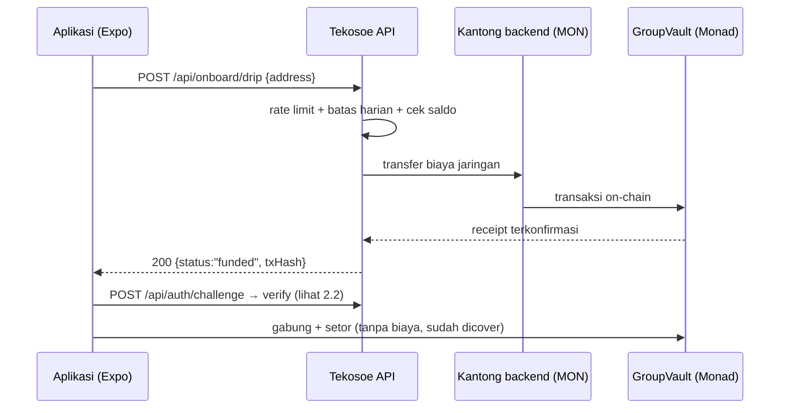
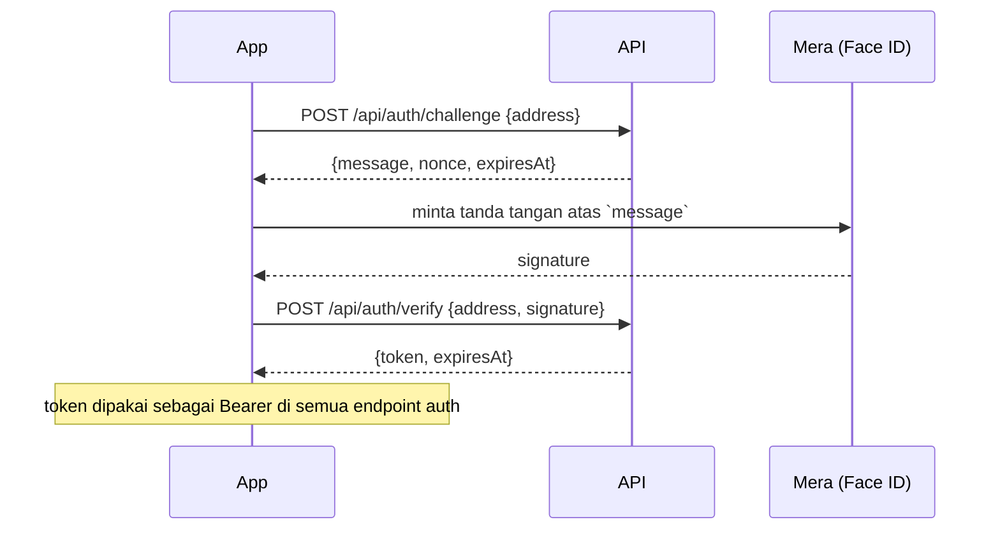
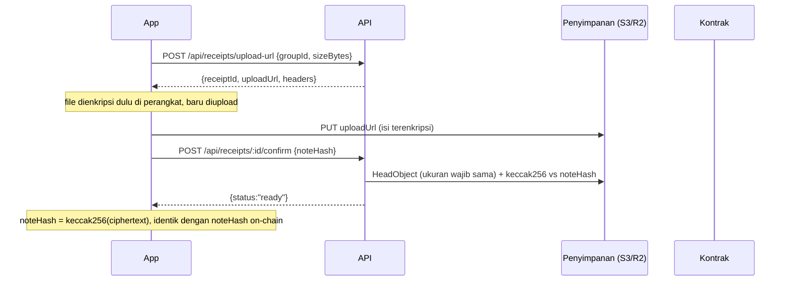
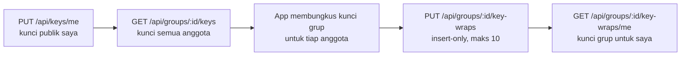
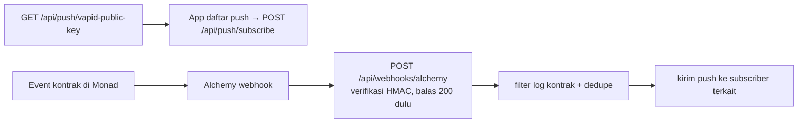

# Tekosoe API — dokumentasi & flow

Dokumen ini untuk manusia (app developer / juri). Spec teknis mesin ada di
[`openapi.yaml`](./openapi.yaml) dan interaktif di **Swagger UI**:

| | |
| --- | --- |
| Swagger UI | `GET /api/docs` → `http://localhost:3000/api/docs` |
| OpenAPI 3.1 | `GET /api/openapi.yaml` |
| Base URL lokal | `http://localhost:3000` |

Jalankan server dengan `npm run dev` (atau `npm start`).

---

## 1. Konvensi

### Envelope error

Semua error memakai bentuk yang sama:

```json
{ "error": { "code": "NOT_GROUP_MEMBER", "message": "You are not a member of this group", "details": {} } }
```

`code` selalu `SCREAMING_SNAKE` dan itulah yang dibaca app; `message` untuk
debugging manusia; `detail` berisi konteks (mis. `issues` untuk validasi).

| Status | Kode yang mungkin | Arti |
| --- | --- | --- |
| 400 | `VALIDATION_ERROR`, `INVALID_ADDRESS`, `INVALID_GROUP_ID` | input tidak lolos validasi |
| 401 | `MISSING_TOKEN`, `INVALID_TOKEN`, `INVALID_SIGNATURE`, `CHALLENGE_NOT_FOUND`, `UNAUTHORIZED` | belum login / tanda tangan salah / tantangan terpakai |
| 403 | `FORBIDDEN`, `ADMIN_KEY_NOT_CONFIGURED`, `NOT_GROUP_MEMBER`, `NOT_RECEIPT_OWNER` | ditolak izin |
| 404 | `NOT_FOUND`, `PROFILE_NOT_FOUND`, `RECEIPT_NOT_FOUND`, `RECEIPT_NOT_UPLOADED`, `KEY_WRAP_NOT_FOUND`, `FEATURE_DISABLED` | tidak ada / fitur mati |
| 409 | `DRIP_IN_PROGRESS` | permintaan sebelumnya masih jalan |
| 413 | `PAYLOAD_TOO_LARGE`, `RECEIPT_TOO_LARGE` | badan/berkas terlalu besar |
| 429 | `RATE_LIMITED`, `DRIP_LIMIT_REACHED` | kena batas laju |
| 500 | `INTERNAL_ERROR` | kegagalan tak terduga |
| 502 | `DRIP_FAILED` | pengiriman biaya jaringan gagal (boleh dicoba lagi) |

### Dua metode auth

| Dipakai untuk | Cara |
| --- | --- |
| Endpoint app (profil, struk, kunci, push) | `Authorization: Bearer <JWT>` — token dari `POST /api/auth/verify` |
| Endpoint admin (`/api/status`, `/api/admin/*`) | header `x-admin-key: <ADMIN_API_KEY>` |

Tidak ada endpoint yang menerima kunci privat atau tanda tangan transaksi dari user —
transaksi on-chain ditandatangani oleh kantong backend di sisi server.

### Fitur bersyarat (feature flag)

| Flag | Endpoint yang hanya muncul kalau `true` |
| --- | --- |
| `FEATURE_RECEIPTS` | `/api/receipts/*`, `/api/groups/:id/receipts`, `/api/keys/me`, `/api/groups/:id/keys`, `/api/groups/:id/key-wraps*` |
| `FEATURE_PUSH` | `/api/push/*`, `/api/webhooks/alchemy` |

Kalau flag mati, route tidak dipasang sama sekali → balasan `404 NOT_FOUND`.

### Konvensi lain

- **`groupId` selalu string desimal** (`"12"`), bukan number — id grup adalah bigint on-chain.
- **Uang tidak pernah lewat API ini.** Saldo, pemakaian, dan hasil settle hanya dibaca
  dari kontrak + Envio; kalau app butuh nominal, tampilkan dari data indexer dalam
  format dolar.
- **Profil bersifat publik** (layar undangan butuh nama sebelum user gabung).
- Waktu selalu ISO 8601 (`2026-09-30T12:00:00.000Z`).

### Rate limit

| Endpoint | Batas | Kunci |
| --- | --- | --- |
| `POST /api/onboard/drip` | `DRIP_RATE_LIMIT_PER_HOUR` per jam (default 5) + `DRIP_DAILY_CAP` per hari (default 200) | IP |
| `POST /api/auth/challenge`, `/verify` | 30 / menit | IP |
| `GET /api/profiles` | 120 / jam | IP |
| `POST /api/receipts/upload-url` | 30 / jam | alamat user |

---

## 2. Flow

### 2.1 Akun baru dibuka (onboarding)

App belum punya sesi, jadi endpoint drip memang tanpa auth — dilindungi rate limit,
batas harian, satu klaim per alamat, dan cek saldo.



Kemungkinan balasan `200`:

| `status` | Arti untuk app |
| --- | --- |
| `funded` | dana terkirim dan terkonfirmasi → lanjut ke langkah berikutnya |
| `already_funded` | alamat ini sudah pernah dapat → langsung lanjut |
| `sufficient_balance` | saldonya masih cukup → langsung lanjut |

### 2.2 Login (SIWE, tiap sesi)



- Tantangan berlaku **5 menit**, **hanya bisa dipakai sekali** (anti-replay).
- Pesan dibangun ulang dari nonce tersimpan — server tidak menyimpan teks pesan.
- Token JWT HS256, TTL `AUTH_TOKEN_TTL_SECONDS` (default 1 jam).

### 2.3 Settle (pelunasan akhir trip)

```mermaid
flowchart LR
  A[Scheduler tiap SETTLE_INTERVAL_MS] --> B[Envio: grup yang sudah jatuh tempo?]
  B -- ya --> C[GroupVault.settle() oleh settler wallet]
  C --> D[settle_runs dicatat]
  E[POST /api/admin/settle/:groupId] --> C
  F[GET /api/admin/settle] --> D
```

- Scheduler berjalan in-process (bukan cron); gagal RPC/indexer = tick dilewati, dicoba lagi.
- Endpoint admin hanya jaring pengaman demo (`x-admin-key`), mengabaikan backoff.

### 2.4 Struk terenkripsi (butuh `FEATURE_RECEIPTS=true`)



Saat detail pemakaian dibuka dari Envio, app memanggil
`GET /api/receipts/by-hash/:noteHash` (wajib anggota grup) untuk dapat tautan unduh.

### 2.5 Tukar kunci grup (butuh `FEATURE_RECEIPTS=true`)



### 2.6 Notifikasi (butuh `FEATURE_PUSH=true`)



---

## 3. Indeks endpoint

| # | Method | Path | Auth | Fitur |
| --- | --- | --- | --- | --- |
| 1 | GET | `/health` | — | operasional |
| 2 | GET | `/api/status` | `x-admin-key` | operasional |
| 3 | POST | `/api/onboard/drip` | — | onboarding |
| 4 | POST | `/api/auth/challenge` | — | auth |
| 5 | POST | `/api/auth/verify` | — | auth |
| 6 | PUT | `/api/profiles/me` | Bearer | profiles |
| 7 | GET | `/api/profiles/me` | Bearer | profiles |
| 8 | GET | `/api/profiles?addresses=` | — | profiles |
| 9 | POST | `/api/admin/settle/:groupId` | `x-admin-key` | operasional |
| 10 | GET | `/api/admin/settle` | `x-admin-key` | operasional |
| 11 | POST | `/api/receipts/upload-url` | Bearer | `FEATURE_RECEIPTS` |
| 12 | POST | `/api/receipts/:id/confirm` | Bearer | `FEATURE_RECEIPTS` |
| 13 | GET | `/api/receipts/by-hash/:noteHash` | Bearer | `FEATURE_RECEIPTS` |
| 14 | GET | `/api/groups/:groupId/receipts` | Bearer + anggota | `FEATURE_RECEIPTS` |
| 15 | PUT | `/api/keys/me` | Bearer | `FEATURE_RECEIPTS` |
| 16 | GET | `/api/groups/:groupId/keys` | Bearer + anggota | `FEATURE_RECEIPTS` |
| 17 | PUT | `/api/groups/:groupId/key-wraps` | Bearer + anggota | `FEATURE_RECEIPTS` |
| 18 | GET | `/api/groups/:groupId/key-wraps/me` | Bearer + anggota | `FEATURE_RECEIPTS` |
| 19 | GET | `/api/push/vapid-public-key` | — | `FEATURE_PUSH` |
| 20 | POST | `/api/push/subscribe` | Bearer | `FEATURE_PUSH` |
| 21 | DELETE | `/api/push/subscribe` | Bearer | `FEATURE_PUSH` |
| 22 | POST | `/api/webhooks/alchemy` | HMAC header | `FEATURE_PUSH` |

---

## 4. Operasional

### 1. `GET /health`

Liveness probe Railway — tanpa dependensi, tidak pernah gagal.

```bash
curl $BASE/health
# {"status":"ok"}
```

### 2. `GET /api/status` — status lengkap (admin)

Untuk dashboard/pantauan: ping database, blok terakhir, ping Envio, isi scheduler,
saldo dua kantong backend (dengan flag `low` kalau di bawah
`LOW_BALANCE_THRESHOLD_MON`), dan status fitur. Tidak pernah mengembalikan secret.

```bash
curl -H "x-admin-key: $ADMIN_KEY" $BASE/api/status
```

```json
{
  "status": "degraded",
  "db": { "ok": true, "latencyMs": 12 },
  "chain": { "ok": false, "chainId": null, "error": "..." },
  "envio": { "ok": false },
  "scheduler": { "lastTickAt": "…", "lastTickDurationMs": 3, "lastError": null, "dueCandidates": 0, "running": false },
  "wallets": {
    "drip":   { "address": "0x19E7…ff2A", "balanceMon": 1.2, "low": false },
    "settler":{ "address": "0x1563…5508", "balanceMon": 0.9, "low": false }
  },
  "features": { "receipts": false, "push": false }
}
```

| Status | Kode | Kapan |
| --- | --- | --- |
| 403 | `ADMIN_KEY_NOT_CONFIGURED` | `ADMIN_API_KEY` kosong di server |
| 403 | `FORBIDDEN` | `x-admin-key` salah |

### 9. `POST /api/admin/settle/:groupId` — settle paksa (admin)

Menjalankan settle satu grup sekarang, mengabaikan backoff. Jaring pengaman demo.

```bash
curl -X POST -H "x-admin-key: $ADMIN_KEY" $BASE/api/admin/settle/1
```

```json
{ "groupId": "1", "status": "confirmed", "txHash": "0x…", "attempts": 1, "durationMs": 842 }
```

`status`: `confirmed` · `skipped` (sudah lunas / tidak ada tagihan) · `failed` ·
`too_early` (belum lewat tanggal) · `backoff` (percobaan sebelumnya masih ditunggu).
Error: `400 VALIDATION_ERROR` (bukan desimal), `403` seperti #2.

### 10. `GET /api/admin/settle` — riwayat settle (admin)

50 baris `settle_runs` terbaru.

```json
{ "runs": [ { "groupId": "1", "status": "confirmed", "txHash": "0x…", "attempts": 1,
              "nextAttemptAt": null, "lastError": null, "updatedAt": "…" } ] }
```

---

## 5. Onboarding

### 3. `POST /api/onboard/drip` — biaya jaringan untuk akun baru

**Untuk apa:** akun baru belum punya MON, padahal transaksi pertamanya (gabung +
setor) butuh biaya jaringan. Endpoint ini tanpa auth karena sesi belum ada, jadi
dilindungi rate limit per IP, batas harian global, satu klaim per alamat, dan cek
saldo kantong backend. Balasan `funded` hanya keluar setelah transaksi benar-benar
terkonfirmasi.

```bash
curl -X POST -H "content-type: application/json" \
  -d '{"address":"0x1111111111111111111111111111111111111111"}' \
  $BASE/api/onboard/drip
```

Request body:

| Field | Tipe | Aturan |
| --- | --- | --- |
| `address` | string | wajib, `0x` + 40 hex |

Response `200`:

| Field | Tipe | Kapan |
| --- | --- | --- |
| `status` | `already_funded` \| `sufficient_balance` \| `funded` | hasil |
| `txHash` | string | hanya saat `status = "funded"` |

| Status | Kode | Kapan |
| --- | --- | --- |
| 400 | `VALIDATION_ERROR` | alamat tidak valid |
| 409 | `DRIP_IN_PROGRESS` | klaim sebelumnya masih berjalan — coba lagi |
| 429 | `DRIP_LIMIT_REACHED` | rate limit per IP **atau** batas harian tercapai |
| 502 | `DRIP_FAILED` | kantong backend kosong/gagal kirim — klaim dilepas, boleh ulang |

---

## 6. Auth (SIWE)

### 4. `POST /api/auth/challenge` — minta tantangan login

**Untuk apa:** app meminta teks yang akan ditandatangani Mera (Face ID).

```bash
curl -X POST -H "content-type: application/json" \
  -d '{"address":"0x1111111111111111111111111111111111111111"}' \
  $BASE/api/auth/challenge
```

Response `200`:

| Field | Tipe | Catatan |
| --- | --- | --- |
| `message` | string | pesan EIP-4361, tanda tangani **persis** |
| `nonce` | string | 16 byte hex, sekali pakai |
| `expiresAt` | string (ISO) | 5 menit dari sekarang |

Error: `400 VALIDATION_ERROR` · `429 RATE_LIMITED` (30/menit per IP).

### 5. `POST /api/auth/verify` — tukar tanda tangan dengan token

```bash
curl -X POST -H "content-type: application/json" \
  -d '{"address":"0x1111111111111111111111111111111111111111","signature":"0x…"}' \
  $BASE/api/auth/verify
```

| Field | Tipe | Aturan |
| --- | --- | --- |
| `address` | string | `0x` + 40 hex |
| `signature` | string | `0x` + hex, maks 1030 karakter |

Response `200`: `{ "token": "…", "expiresAt": "…" }` → pakai sebagai
`Authorization: Bearer <token>`.

| Status | Kode | Kapan |
| --- | --- | --- |
| 401 | `INVALID_SIGNATURE` | tanda tangan tidak cocok dengan `address` |
| 401 | `CHALLENGE_NOT_FOUND` | tantangan sudah dipakai / kedaluwarsa / bukan milik alamat ini |
| 429 | `RATE_LIMITED` | 30/menit per IP |

---

## 7. Profil

### 6. `PUT /api/profiles/me` — simpan nama tampilan

Nama tampilan dipakai layar undangan; bersifat **publik**.

```bash
curl -X PUT -H "authorization: Bearer $TOKEN" -H "content-type: application/json" \
  -d '{"displayName":"Naya","avatar":"🧳"}' $BASE/api/profiles/me
```

| Field | Tipe | Aturan |
| --- | --- | --- |
| `displayName` | string | wajib; 1–40 karakter setelah trim; tanpa karakter kontrol |
| `avatar` | string | opsional, maks 32; emoji/kunci preset — **URL ditolak** |

Response `200`: `{ "address": "0x…EIP55", "displayName": "Naya", "avatar": "🧳", "updatedAt": "…" }`

Error: `400 VALIDATION_ERROR` · `401 MISSING_TOKEN` / `INVALID_TOKEN`.

### 7. `GET /api/profiles/me` — profil milik sendiri

Response seperti #6. `404 PROFILE_NOT_FOUND` = belum pernah mengisi profil
(app memakainya untuk menentukan apakah perlu ke layar isi nama).

### 8. `GET /api/profiles?addresses=…` — banyak profil (publik)

Dipakai layar link undangan sebelum user bergabung.

```bash
curl "$BASE/api/profiles?addresses=0x1111…,0x2222…"
```

| Query | Aturan |
| --- | --- |
| `addresses` | wajib, dipisah koma, maks 20 alamat, semua harus valid |

Response `200`: `{ "profiles": [ { "address", "displayName", "avatar" } ] }` —
hanya alamat yang punya profil yang dikembalikan.

Error: `400 VALIDATION_ERROR` (kosong / >20 / ada yang invalid) · `429 RATE_LIMITED` (120/jam).

---

## 8. Struk (`FEATURE_RECEIPTS=true`)

Untuk alur lengkap lihat §2.4. Backend hanya menerima **ciphertext** — enkripsi
terjadi di perangkat.

### 11. `POST /api/receipts/upload-url` — minta tautan unggah

```bash
curl -X POST -H "authorization: Bearer $TOKEN" -H "content-type: application/json" \
  -d '{"groupId":"1","sizeBytes":20480}' $BASE/api/receipts/upload-url
```

| Field | Tipe | Aturan |
| --- | --- | --- |
| `groupId` | string | wajib, desimal |
| `sizeBytes` | integer | wajib, > 0, ≤ `RECEIPT_MAX_BYTES` (default 5 MB) |

Response `201`:

```json
{ "receiptId": "…", "uploadUrl": "https://…", "headers": { "content-type": "application/octet-stream" }, "expiresInSeconds": 300 }
```

App melakukan `PUT uploadUrl` dengan header dari `headers`, lalu memanggil #12.

| Status | Kode | Kapan |
| --- | --- | --- |
| 400 | `VALIDATION_ERROR` | format salah |
| 403 | `NOT_GROUP_MEMBER` | bukan anggota grup (dicek **on-chain**) |
| 413 | `RECEIPT_TOO_LARGE` | melebihi `RECEIPT_MAX_BYTES` (`details.maxBytes`) |
| 429 | `RATE_LIMITED` | 30/jam per alamat |

### 12. `POST /api/receipts/:id/confirm` — tandai siap

```bash
curl -X POST -H "authorization: Bearer $TOKEN" -H "content-type: application/json" \
  -d '{"noteHash":"0x…64hex"}' $BASE/api/receipts/<receiptId>/confirm
```

| Field | Tipe | Aturan |
| --- | --- | --- |
| `noteHash` | string | `0x` + tepat 64 hex — = `keccak256(ciphertext)` |

Server memeriksa `HeadObject`: ukuran wajib **persis** sama dengan yang
dideklarasikan; kalau `RECEIPT_VERIFY_HASH=true`, isi diunduh dan hash-nya
dibandingkan. Idempoten (konfirmasi ulang = tetap `ready`).

Response `200`: `{ "receiptId": "…", "status": "ready" }`

| Status | Kode | Kapan |
| --- | --- | --- |
| 400 | `VALIDATION_ERROR` | ukuran beda (`details.reason="size does not match the declared size"`) atau hash beda |
| 403 | `NOT_RECEIPT_OWNER` | hanya pengunggah yang boleh konfirmasi |
| 404 | `RECEIPT_NOT_FOUND` / `RECEIPT_NOT_UPLOADED` | tidak ada / belum terunggah |
| 413 | `PAYLOAD_TOO_LARGE` | objek melebihi batas — objek ikut dihapus |

### 13. `GET /api/receipts/by-hash/:noteHash` — tautan unduh

Dipanggil saat app membuka detail pemakaian (hash datang dari data Envio).

```bash
curl -H "authorization: Bearer $TOKEN" $BASE/api/receipts/by-hash/0x…64hex
```

```json
{ "receiptId": "…", "groupId": "1", "sizeBytes": 20480, "downloadUrl": "https://…" }
```

`downloadUrl` berlaku 5 menit. Error: `400 VALIDATION_ERROR` ·
`403 NOT_GROUP_MEMBER` · `404 RECEIPT_NOT_FOUND`.

### 14. `GET /api/groups/:groupId/receipts` — daftar struk satu grup

Hanya metadata struk `ready` (tanpa tautan unduh). Wajib anggota.

```json
{ "receipts": [ { "receiptId", "groupId", "uploader", "noteHash", "sizeBytes", "status", "createdAt" } ] }
```

Error: `400 INVALID_GROUP_ID` · `401` · `403 NOT_GROUP_MEMBER`.

---

## 9. Kunci grup (`FEATURE_RECEIPTS=true`)

Untuk alur lihat §2.5. Backend hanya menyimpan **kunci publik** dan salinan yang
sudah dibungkus; tidak pernah kunci privat.

### 15. `PUT /api/keys/me` — publikasikan kunci enkripsi saya

```bash
curl -X PUT -H "authorization: Bearer $TOKEN" -H "content-type: application/json" \
  -d '{"encPublicKey":"…"}' $BASE/api/keys/me
```

| Field | Tipe | Aturan |
| --- | --- | --- |
| `encPublicKey` | string | wajib, 1–200 karakter |

Response `200`: `{ "address": "0x…", "encPublicKey": "…" }` (upsert).
Error: `400` · `401`.

### 16. `GET /api/groups/:groupId/keys` — kunci semua anggota

Daftar anggota dibaca langsung dari kontrak (`membersOf`); yang belum menyimpan
kunci kembali `null`.

```json
{ "keys": [ { "address": "0x…", "encPublicKey": "…" }, { "address": "0x…", "encPublicKey": null } ] }
```

Error: `400 INVALID_GROUP_ID` · `401` · `403 NOT_GROUP_MEMBER`.

### 17. `PUT /api/groups/:groupId/key-wraps` — kirim kunci grup terbungkus

```bash
curl -X PUT -H "authorization: Bearer $TOKEN" -H "content-type: application/json" \
  -d '{"wraps":[{"member":"0x…","wrappedKey":"…"}]}' \
  $BASE/api/groups/1/key-wraps
```

| Field | Tipe | Aturan |
| --- | --- | --- |
| `wraps` | array | wajib, 1–10 item |
| `wraps[].member` | string | `0x` + 40 hex, **wajib anggota kontrak** |
| `wraps[].wrappedKey` | string | 1–4000 karakter |

**Insert-only**: wrap yang sudah ada tidak pernah ditimpa.

Response `200`: `{ "created": 1, "requested": 1 }` — `created` < `requested` berarti
sebagian sudah terlanjur ada.

Error: `400` · `401` · `403 NOT_GROUP_MEMBER` (alamat `member` bukan anggota).

### 18. `GET /api/groups/:groupId/key-wraps/me` — kunci grup untuk saya

```json
{ "wrappedKey": "…", "wrappedBy": "0x…", "createdAt": "…" }
```

`404 KEY_WRAP_NOT_FOUND` = belum ada yang mengirim kunci untuk anggota ini
(artinya app harus menunggu / meminta anggota lain mengunggah).

---

## 10. Push (`FEATURE_PUSH=true`)

### 19. `GET /api/push/vapid-public-key` — kunci VAPID publik

```json
{ "publicKey": "B…" }
```

Dipakai app saat mendaftarkan langganan. Tidak butuh auth.

### 20. `POST /api/push/subscribe` — daftar notifikasi

```bash
curl -X POST -H "authorization: Bearer $TOKEN" -H "content-type: application/json" \
  -d '{"endpoint":"https://…","keys":{"p256dh":"…","auth":"…"}}' \
  $BASE/api/push/subscribe
```

| Field | Tipe | Aturan |
| --- | --- | --- |
| `endpoint` | string | wajib, URL valid, maks 2048 |
| `keys.p256dh` | string | wajib, 1–512 |
| `keys.auth` | string | wajib, 1–512 |

Response `201`: `{ "ok": true }` (upsert per `endpoint`).
Error: `400` · `401`.

### 21. `DELETE /api/push/subscribe` — cabut langganan

Body: `{ "endpoint": "https://…" }` → `200 { "ok": true }`. Idempoten.

### 22. `POST /api/webhooks/alchemy` — penerima event kontrak

Dipanggil **oleh Alchemy**, bukan app. Body dibaca dalam bentuk mentah
(`express.raw`), signature HMAC-SHA256 dari `ALCHEMY_WEBHOOK_SIGNING_KEY`
dibandingkan dengan header `x-alchemy-signature` secara constant-time.

```bash
curl -X POST -H "content-type: application/json" -H "x-alchemy-signature: $SIG" \
  --data-binary @payload.json $BASE/api/webhooks/alchemy
```

Alur pemrosesan (setelah balasan `200`): filter log agar hanya milik
`GROUP_VAULT_ADDRESS` → dedup via `processed_events` (Alchemy mengirim ulang) →
decode event → `dispatchEvent` → push notification.

| Status | Kode | Kapan |
| --- | --- | --- |
| 200 | — | `{ "received": true }`, diproses setelah balasan |
| 401 | `INVALID_SIGNATURE` | signature salah/tidak ada |

---

## 11. Menjalankan & deploy

```bash
npm run dev      # development (auto-reload)
npm start        # production
npm run typecheck
npm test
```

Semua variabel ada di [`.env.example`](../.env.example). `RELAXED_ENV=true` hanya
untuk mengangkat server sebelum env lengkap (development saja — cek startup jadi
peringatan, bukan berhenti).

**Railway (checklist):** 1 replika (scheduler in-process) · healthcheck path
`/health` · pre-deploy command `npm run db:migrate` · set variabel (termasuk
`CORS_ORIGINS` untuk origin mobile) · jangan pernah set `RELAXED_ENV=true`.

> Spek mesin (`openapi.yaml`) dan dokumen ini ditulis dari kode yang sama;
> kalau ada beda, kode yang menang — perbaiki keduanya.
