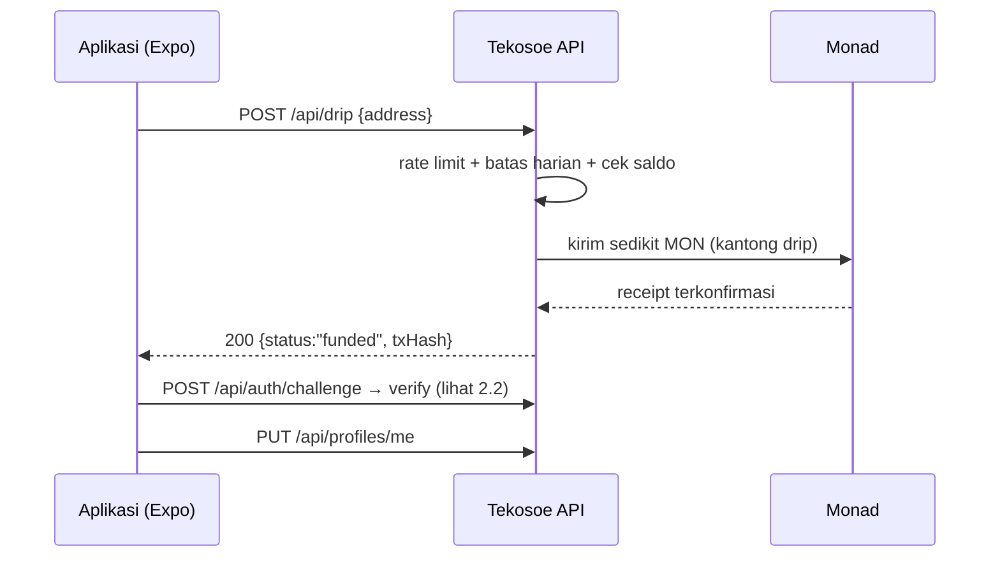
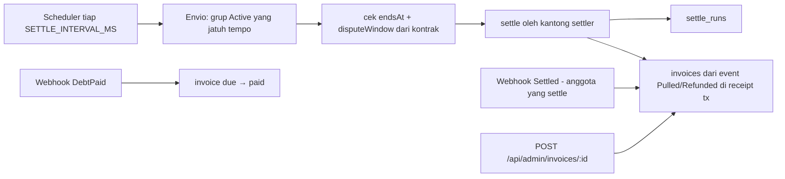
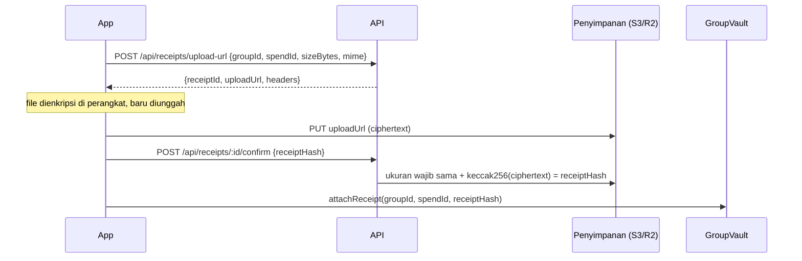
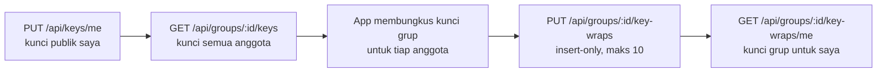
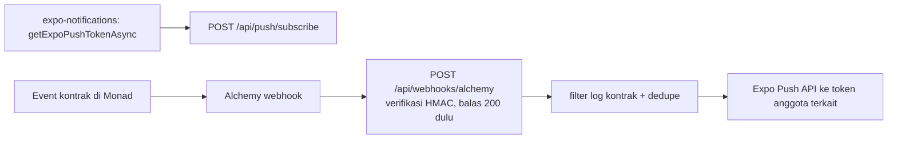

# Tekosoe API — dokumentasi & flow

Dokumen ini untuk manusia (app developer / juri). Spec teknis mesin ada di
[`openapi.yaml`](./openapi.yaml) dan interaktif di **Swagger UI**:

| | |
| --- | --- |
| Swagger UI | `GET /api/docs` → `http://localhost:3000/api/docs` |
| OpenAPI 3.1 | `GET /api/openapi.yaml` |
| Base URL lokal | `http://localhost:3000` |

Jalankan server dengan `npm run dev -w @tekosoe/api` dari root repo.

---

## 1. Konvensi

### Envelope error

Semua error memakai bentuk yang sama:

```json
{ "error": { "code": "NOT_GROUP_MEMBER", "message": "You are not a member of this group", "details": {} } }
```

`code` selalu `SCREAMING_SNAKE` dan itulah yang dibaca app; `message` untuk
debugging manusia; `details` berisi konteks (mis. `issues` untuk validasi).

| Status | Kode yang mungkin | Arti |
| --- | --- | --- |
| 400 | `VALIDATION_ERROR`, `INVALID_ADDRESS`, `INVALID_GROUP_ID` | input tidak lolos validasi |
| 401 | `MISSING_TOKEN`, `INVALID_TOKEN`, `INVALID_SIGNATURE`, `CHALLENGE_NOT_FOUND`, `INVALID_SHARE_TOKEN`, `UNAUTHORIZED` | belum login / tanda tangan salah / tautan kedaluwarsa |
| 403 | `FORBIDDEN`, `ADMIN_KEY_NOT_CONFIGURED`, `NOT_GROUP_MEMBER`, `NOT_GROUP_CREATOR`, `NOT_SPENDER`, `NOT_RECEIPT_OWNER` | ditolak izin |
| 404 | `NOT_FOUND`, `PROFILE_NOT_FOUND`, `GROUP_META_NOT_FOUND`, `SPEND_NOT_FOUND`, `INVOICE_NOT_FOUND`, `RECEIPT_NOT_FOUND`, `RECEIPT_NOT_UPLOADED`, `KEY_WRAP_NOT_FOUND`, `FEATURE_DISABLED` | tidak ada / fitur mati |
| 409 | `DRIP_IN_PROGRESS`, `GROUP_META_EXISTS` | bentrok dengan data yang sudah ada |
| 413 | `PAYLOAD_TOO_LARGE`, `RECEIPT_TOO_LARGE` | badan/berkas terlalu besar |
| 422 | `NOTE_HASH_MISMATCH` | isi tidak cocok dengan data on-chain |
| 429 | `RATE_LIMITED`, `DRIP_LIMIT_REACHED` | kena batas laju |
| 500 | `INTERNAL_ERROR` | kegagalan tak terduga |
| 502 | `DRIP_FAILED` | pengiriman biaya jaringan gagal (boleh dicoba lagi) |

### Tiga jenis kredensial

| Dipakai untuk | Cara |
| --- | --- |
| Endpoint app | `Authorization: Bearer <JWT>` — token sesi dari `POST /api/auth/verify` |
| Tautan invoice untuk web | `?token=<shareToken>` dari `GET /api/groups/:id/invoices/me` (7 hari, hanya untuk satu nomor invoice, tidak bisa dipakai sebagai token sesi) |
| Endpoint admin (`/api/status`, `/api/admin/*`) | header `x-admin-key: <ADMIN_API_KEY>` |

Tidak ada endpoint yang menerima kunci privat atau tanda tangan transaksi dari user —
transaksi on-chain user ditandatangani di perangkat (Mera); backend hanya mengirim
drip MON dan `settle`.

### Fitur bersyarat (feature flag)

| Flag | Endpoint yang hanya muncul kalau `true` |
| --- | --- |
| `FEATURE_RECEIPTS` | `/api/receipts/*`, `/api/groups/:id/receipts`, `/api/keys/me`, `/api/groups/:id/keys`, `/api/groups/:id/key-wraps*` |
| `FEATURE_PUSH` | `/api/push/*`, `/api/webhooks/alchemy` |

Kalau flag mati, route tidak dipasang sama sekali → balasan `404 NOT_FOUND`.

### Konvensi lain

- **`groupId` / `spendId` selalu string desimal** (`"12"`), bukan number — id on-chain adalah uint256.
- **Saldo tidak pernah lewat API ini.** Saldo, pemakaian, dan anggota dibaca dari
  kontrak + Envio. Satu-satunya nominal di API adalah `payload` invoice (hasil settle,
  string desimal AUSD 6 desimal) yang juga bisa dihitung ulang dari chain.
- **Metadata dikunci ke chain:** judul pemakaian diterima hanya kalau
  `computeNoteHash` (dari `@tekosoe/shared`) = `noteHash` on-chain; detail trip hanya dari
  creator on-chain. Rahasia undangan tidak pernah dikirim ke api.
- **Profil dan nama trip bersifat publik** (layar undangan butuh nama sebelum user gabung).
- Keanggotaan selalu dicek ke kontrak (`membersOf`), bukan ke Envio.
- Waktu selalu ISO 8601 (`2026-09-30T12:00:00.000Z`).

### Rate limit

| Endpoint | Batas | Kunci |
| --- | --- | --- |
| `POST /api/drip` | `DRIP_RATE_LIMIT_PER_HOUR` per jam (default 5) + `DRIP_DAILY_CAP` per hari (default 200) | IP |
| `POST /api/auth/challenge`, `/verify` | 30 / menit | IP |
| `GET /api/profiles`, `GET /api/groups/:id/meta`, `GET /api/invoices/:number` | 120 / jam | IP |
| `POST /api/receipts/upload-url` | 30 / jam | alamat user |

---

## 2. Flow

### 2.1 Akun baru dibuka (onboarding)

App belum punya sesi, jadi endpoint drip memang tanpa auth — dilindungi rate limit,
batas harian, satu klaim per alamat, dan cek saldo.



Kemungkinan balasan `200`: `funded` (terkirim dan terkonfirmasi), `already_funded`
(alamat ini sudah pernah dapat), `sufficient_balance` (saldonya masih cukup).

### 2.2 Login (SIWE, tiap sesi)


- Tantangan berlaku **5 menit**, **hanya bisa dipakai sekali** (anti-replay).
- Pesan EIP-4361 dibangun ulang dari nonce tersimpan; tanda tangan EIP-191 dicek dengan `verifyMessage` (akun Mera = EOA).
- Token JWT HS256, TTL `AUTH_TOKEN_TTL_SECONDS` (default 1 jam).

### 2.3 Buat trip, pakai kas, beri label

```mermaid
sequenceDiagram
  participant App
  participant C as GroupVault
  participant API

  App->>C: createGroup(name, inviteKey, …)
  App->>API: PUT /api/groups/:id/meta {name}
  Note over API: hanya creator on-chain
  App->>App: noteHash = computeNoteHash({title, category, note, receiptHash})
  App->>C: spend(…, noteHash)
  App->>API: PUT /api/groups/:id/spends/:spendId/meta {title, category, note, receiptHash}
  Note over API: hanya spender; ditolak 422 kalau hash ≠ noteHash on-chain
  App->>API: GET /api/groups/:id/spends/meta (label untuk Activity)
```

### 2.4 Settle dan invoice



- Invoice: satu per anggota, nomor `INV-{trip}-{urutan}` (urutan = posisi di `membersOf`),
  `invoiceHash = keccak256(payload)`; `payload` dibuat oleh `buildInvoicePayload` di
  `@tekosoe/shared` dan bisa dihitung ulang siapa pun dari receipt tx settle.
- Status: `refunded` (menerima kembalian), `due` (masih ada debt), `paid`. Status tidak ikut di-hash.
- Pembuatan invoice tidak pernah menghalangi settle; kalau gagal, sweep berikutnya mencoba lagi.

### 2.5 Struk terenkripsi (butuh `FEATURE_RECEIPTS=true`)



Saat detail pemakaian dibuka, `receiptHash` dari Envio dipakai untuk
`GET /api/receipts/by-hash/:receiptHash` (wajib anggota grup) → tautan unduh.

### 2.6 Tukar kunci grup (butuh `FEATURE_RECEIPTS=true`)



### 2.7 Notifikasi (butuh `FEATURE_PUSH=true`)



Token yang dibalas `DeviceNotRegistered` oleh Expo langsung dihapus.

---

## 3. Indeks endpoint

| # | Method | Path | Auth | Fitur |
| --- | --- | --- | --- | --- |
| 1 | GET | `/health` | — | operasional |
| 2 | GET | `/api/status` | `x-admin-key` | operasional |
| 3 | POST | `/api/drip` | — | onboarding |
| 4 | POST | `/api/auth/challenge` | — | auth |
| 5 | POST | `/api/auth/verify` | — | auth |
| 6 | PUT | `/api/profiles/me` | Bearer | profil |
| 7 | GET | `/api/profiles/me` | Bearer | profil |
| 8 | GET | `/api/profiles?addresses=` | — | profil |
| 9 | GET | `/api/groups/:groupId/meta` | — | trip |
| 10 | PUT | `/api/groups/:groupId/meta` | Bearer + creator on-chain | trip |
| 11 | GET | `/api/groups/:groupId/spends/meta` | Bearer + anggota | pemakaian |
| 12 | PUT | `/api/groups/:groupId/spends/:spendId/meta` | Bearer + spender | pemakaian |
| 13 | GET | `/api/groups/:groupId/spends/reviews` | Bearer + anggota | pemakaian (P1) |
| 14 | PUT | `/api/groups/:groupId/spends/:spendId/review` | Bearer + anggota | pemakaian (P1) |
| 15 | GET | `/api/groups/:groupId/invoices/me` | Bearer + anggota | invoice |
| 16 | GET | `/api/invoices/:number?token=` | share token | invoice |
| 17 | POST | `/api/admin/settle/:groupId` | `x-admin-key` | operasional |
| 18 | GET | `/api/admin/settle` | `x-admin-key` | operasional |
| 19 | POST | `/api/admin/invoices/:groupId` | `x-admin-key` | operasional |
| 20 | POST | `/api/receipts/upload-url` | Bearer + anggota | `FEATURE_RECEIPTS` |
| 21 | POST | `/api/receipts/:id/confirm` | Bearer | `FEATURE_RECEIPTS` |
| 22 | GET | `/api/receipts/by-hash/:receiptHash` | Bearer + anggota | `FEATURE_RECEIPTS` |
| 23 | GET | `/api/groups/:groupId/receipts` | Bearer + anggota | `FEATURE_RECEIPTS` |
| 24 | PUT | `/api/keys/me` | Bearer | `FEATURE_RECEIPTS` |
| 25 | GET | `/api/groups/:groupId/keys` | Bearer + anggota | `FEATURE_RECEIPTS` |
| 26 | PUT | `/api/groups/:groupId/key-wraps` | Bearer + anggota | `FEATURE_RECEIPTS` |
| 27 | GET | `/api/groups/:groupId/key-wraps/me` | Bearer + anggota | `FEATURE_RECEIPTS` |
| 28 | POST | `/api/push/subscribe` | Bearer | `FEATURE_PUSH` |
| 29 | DELETE | `/api/push/subscribe` | Bearer | `FEATURE_PUSH` |
| 30 | POST | `/api/webhooks/alchemy` | HMAC header | `FEATURE_PUSH` |

---

## 4. Operasional

### 1. `GET /health`

Liveness probe Railway — tanpa dependensi, tidak pernah gagal. `{"status":"ok"}`

### 2. `GET /api/status` — status lengkap (admin)

Ping database, blok terakhir, ping Envio, isi scheduler, saldo dua kantong backend
(`low: true` kalau di bawah `LOW_BALANCE_THRESHOLD_MON`, dan status jadi `degraded`),
dan status fitur. Tidak pernah mengembalikan secret.

```json
{
  "status": "degraded",
  "db": { "ok": true, "latencyMs": 12 },
  "chain": { "ok": true, "chainId": 10143, "latestBlockTimestamp": 1790000000 },
  "envio": { "ok": false },
  "scheduler": { "lastTickAt": "…", "lastTickDurationMs": 3, "lastError": null, "dueCandidates": 0, "running": false },
  "wallets": {
    "drip":   { "address": "0x19E7…ff2A", "balanceMon": 1.2, "low": false },
    "settler":{ "address": "0x1563…5508", "balanceMon": 0.9, "low": false }
  },
  "features": { "receipts": false, "push": false }
}
```

Error: `403 ADMIN_KEY_NOT_CONFIGURED` (`ADMIN_API_KEY` kosong) · `403 FORBIDDEN` (kunci salah).

### 17. `POST /api/admin/settle/:groupId` — settle paksa (admin)

Menjalankan settle satu grup sekarang, mengabaikan backoff. Jaring pengaman demo.

```json
{ "groupId": "1", "status": "confirmed", "txHash": "0x…", "attempts": 1, "durationMs": 842 }
```

`status`: `confirmed` · `skipped` (sudah di-settle) · `failed` · `too_early`
(belum lewat `endsAt + disputeWindow`) · `backoff`.

### 18. `GET /api/admin/settle` — riwayat settle (admin)

50 baris `settle_runs` terbaru: `{ "runs": [ { "groupId", "status", "txHash", "attempts", "nextAttemptAt", "lastError", "updatedAt" } ] }`

### 19. `POST /api/admin/invoices/:groupId` — bangun ulang invoice (admin)

Untuk grup yang di-settle anggota (bukan scheduler) atau saat penulisan invoice gagal.
Tx settle dicari lewat Envio. Idempoten.

`{ "status": "created", "created": 4, "txHash": "0x…" }` · `{ "status": "exists" }` · `{ "status": "not_settled" }`

---

## 5. Onboarding

### 3. `POST /api/drip` — biaya jaringan untuk akun baru

Akun baru belum punya MON, padahal transaksi pertamanya butuh biaya jaringan.
Balasan `funded` hanya keluar setelah transaksi terkonfirmasi.

| Field | Tipe | Aturan |
| --- | --- | --- |
| `address` | string | wajib, `0x` + 40 hex |

Response `200`: `{ "status": "funded" | "already_funded" | "sufficient_balance", "txHash"? }`

| Status | Kode | Kapan |
| --- | --- | --- |
| 400 | `VALIDATION_ERROR` | alamat tidak valid |
| 409 | `DRIP_IN_PROGRESS` | klaim sebelumnya masih berjalan — coba lagi |
| 429 | `DRIP_LIMIT_REACHED` | rate limit per IP **atau** batas harian tercapai |
| 502 | `DRIP_FAILED` | gagal kirim — klaim dilepas, boleh ulang |

---

## 6. Auth (SIWE)

### 4. `POST /api/auth/challenge`

Body `{ "address": "0x…" }` → `200 { "message", "nonce", "expiresAt" }`. `message`
adalah pesan EIP-4361 yang harus ditandatangani **persis**.
Error: `400 VALIDATION_ERROR` · `429 RATE_LIMITED`.

### 5. `POST /api/auth/verify`

| Field | Tipe | Aturan |
| --- | --- | --- |
| `address` | string | `0x` + 40 hex |
| `signature` | string | `0x` + hex, maks 1030 karakter |

Response `200`: `{ "token": "…", "expiresAt": "…" }` → `Authorization: Bearer <token>`.

| Status | Kode | Kapan |
| --- | --- | --- |
| 401 | `INVALID_SIGNATURE` | tanda tangan tidak cocok dengan `address` |
| 401 | `CHALLENGE_NOT_FOUND` | tantangan sudah dipakai / kedaluwarsa / bukan milik alamat ini |
| 429 | `RATE_LIMITED` | 30/menit per IP |

---

## 7. Profil

### 6. `PUT /api/profiles/me` — simpan profil

Sama dengan `profileSchema` di `@tekosoe/shared`. Bersifat **publik**.

```bash
curl -X PUT -H "authorization: Bearer $TOKEN" -H "content-type: application/json" \
  -d '{"displayName":"Naya","countryCode":"ID","city":"Jakarta"}' $BASE/api/profiles/me
```

| Field | Tipe | Aturan |
| --- | --- | --- |
| `displayName` | string | wajib; 1–40 karakter setelah trim; tanpa karakter kontrol |
| `countryCode` | string | wajib; ISO 3166-1 alpha-2 (`"ID"`, `"AU"`), disimpan huruf besar. App memetakan nama negara → kode |
| `city` | string | opsional, maks 60 |
| `avatarColor` | string | opsional, maks 32; warna/kunci preset — **URL ditolak** |

Response `200`: `{ "address", "displayName", "countryCode", "city", "avatarColor", "updatedAt" }`

### 7. `GET /api/profiles/me`

Seperti #6. `404 PROFILE_NOT_FOUND` = belum mengisi profil (app mengarahkan ke Set up profile).

### 8. `GET /api/profiles?addresses=…` — banyak profil (publik)

Maks 20 alamat dipisah koma. `{ "profiles": [ { "address", "displayName", "city", "countryCode", "avatarColor" } ] }` —
hanya alamat yang punya profil. Error: `400` · `429` (120/jam).

---

## 8. Trip dan pemakaian

### 9. `GET /api/groups/:groupId/meta` — detail trip (publik)

Untuk layar undangan sebelum bergabung. `{ "groupId", "name", "createdBy", "createdAt" }`.
`404 GROUP_META_NOT_FOUND`.

### 10. `PUT /api/groups/:groupId/meta` — simpan detail trip

| Field | Tipe | Aturan |
| --- | --- | --- |
| `name` | string | 1–60 karakter setelah trim |

Hanya creator on-chain (`getGroup().creator`). Insert-only: `201` pertama kali, `200`
kalau isinya sama. Error: `403 NOT_GROUP_CREATOR` · `409 GROUP_META_EXISTS`.

### 11. `GET /api/groups/:groupId/spends/meta` — label semua pemakaian

`{ "spends": [ { "groupId", "spendId", "noteHash", "title", "category", "note", "receiptHash", "createdBy", "createdAt" } ] }`.
Pemakaian tanpa baris di sini ditampilkan app tanpa judul ("Unverified" bila perlu).

### 12. `PUT /api/groups/:groupId/spends/:spendId/meta` — beri label pemakaian

Body = `spendNoteSchema` di `@tekosoe/shared`:

| Field | Tipe | Aturan |
| --- | --- | --- |
| `title` | string | 1–80 |
| `category` | string | maks 32, default `"other"` |
| `note` | string | maks 500, default `""` |
| `receiptHash` | string \| null | bytes32, default `null` |

Server membaca `getSpend` on-chain: pemanggil wajib `spender`, dan
`computeNoteHash(body)` wajib = `noteHash` on-chain. `201` pertama kali, `200` kalau
diulang (isinya pasti sama karena hash-nya sama).
Error: `403 NOT_SPENDER` · `403 NOT_GROUP_MEMBER` · `422 NOTE_HASH_MISMATCH` (`details.expected`, `details.computed`).

### 13–14. Review pemakaian (P1)

- `PUT /api/groups/:groupId/spends/:spendId/review` body `{ "seen"?: true, "decisionNote"?: string | null }` (maks 280) → `{ "spendId", "member", "seenAt", "decisionNote" }`. `seenAt` menyimpan waktu pertama kali dilihat.
- `GET /api/groups/:groupId/spends/reviews` → `{ "reviews": [ … ] }`.

---

## 9. Invoice

### 15. `GET /api/groups/:groupId/invoices/me` — invoice saya

```json
{
  "number": "INV-12-003",
  "groupId": "12",
  "member": "0x…",
  "status": "due",
  "invoiceHash": "0x…",
  "payload": "{\"chainId\":10143,\"groupId\":\"12\",…,\"v\":1}",
  "debtPaid": "0",
  "issuedAt": "…",
  "shareToken": "eyJ…"
}
```

`payload` adalah byte persis yang di-hash; parse untuk membaca `pulled`, `refunded`,
`remainingDebt`, `remainingCredit` (string desimal, AUSD 6 desimal) dan `settleTxHash`.
Rincian pemakaian di layar invoice tetap diambil dari Envio + #11.
`shareToken` dipakai untuk QR/tautan ke halaman web `/v/{number}?token=…`.
`404 INVOICE_NOT_FOUND` = settle belum selesai atau invoice belum dibuat.

### 16. `GET /api/invoices/:number?token=…` — invoice untuk halaman verifikasi web

Sama seperti #15 tanpa `shareToken`. Halaman web menghitung ulang `payload` dari
receipt tx settle (`buildInvoicePayload`) dan mencocokkan `invoiceHash`.
Error: `401 INVALID_SHARE_TOKEN` (token salah/kedaluwarsa/untuk nomor lain) · `404` · `429`.

---

## 10. Struk (`FEATURE_RECEIPTS=true`)

Backend hanya menerima **ciphertext** — enkripsi terjadi di perangkat.

### 20. `POST /api/receipts/upload-url`

| Field | Tipe | Aturan |
| --- | --- | --- |
| `groupId` | string | wajib, desimal; pemanggil wajib anggota (on-chain) |
| `spendId` | string | wajib, desimal; pemakaian wajib ada on-chain |
| `sizeBytes` | integer | > 0, ≤ `RECEIPT_MAX_BYTES` (default 5 MB) |
| `mime` | string | tipe file asli, mis. `image/jpeg`, `application/pdf` |

Response `201`: `{ "receiptId", "uploadUrl", "headers", "expiresInSeconds": 300 }`. Objek
disimpan di `receipts/{groupId}/{spendId}/{uuid}.bin`.
Error: `403 NOT_GROUP_MEMBER` · `404 SPEND_NOT_FOUND` · `413 RECEIPT_TOO_LARGE` · `429`.

### 21. `POST /api/receipts/:id/confirm`

Body `{ "receiptHash": "0x…64hex" }` = `keccak256(ciphertext)` = nilai yang dikirim ke
`attachReceipt`. Ukuran wajib persis sama; kalau `RECEIPT_VERIFY_HASH=true` isi diunduh
dan hash-nya dibandingkan. Idempoten. `200 { "receiptId", "status": "ready" }`.
Error: `400 VALIDATION_ERROR` (ukuran/hash beda) · `403 NOT_RECEIPT_OWNER` · `404` · `413`.

### 22. `GET /api/receipts/by-hash/:receiptHash`

`{ "receiptId", "groupId", "spendId", "mime", "sizeBytes", "downloadUrl" }` —
`downloadUrl` berlaku 5 menit. Error: `403 NOT_GROUP_MEMBER` · `404 RECEIPT_NOT_FOUND`.

### 23. `GET /api/groups/:groupId/receipts`

Struk `ready` satu grup (tanpa tautan unduh):
`{ "receipts": [ { "receiptId", "groupId", "spendId", "mime", "uploader", "receiptHash", "sizeBytes", "status", "createdAt" } ] }`

---

## 11. Kunci grup (`FEATURE_RECEIPTS=true`)

Backend hanya menyimpan **kunci publik** dan salinan kunci grup yang sudah dibungkus.

- **24.** `PUT /api/keys/me` body `{ "encPublicKey" }` (1–200) → `{ "address", "encPublicKey" }` (upsert).
- **25.** `GET /api/groups/:groupId/keys` → `{ "keys": [ { "address", "encPublicKey" | null } ] }` (anggota dari `membersOf`).
- **26.** `PUT /api/groups/:groupId/key-wraps` body `{ "wraps": [ { "member", "wrappedKey" } ] }` (1–10, member wajib anggota) → `{ "created", "requested" }`. Insert-only.
- **27.** `GET /api/groups/:groupId/key-wraps/me` → `{ "wrappedKey", "wrappedBy", "createdAt" }`; `404 KEY_WRAP_NOT_FOUND` kalau belum ada.

---

## 12. Push (`FEATURE_PUSH=true`)

### 28. `POST /api/push/subscribe`

| Field | Tipe | Aturan |
| --- | --- | --- |
| `expoPushToken` | string | `ExponentPushToken[…]` / `ExpoPushToken[…]` dari `getExpoPushTokenAsync()` |
| `platform` | `"ios"` \| `"android"` | wajib |

`201 { "ok": true }` (upsert per alamat + token).

### 29. `DELETE /api/push/subscribe`

Body `{ "expoPushToken" }` → `200 { "ok": true }`. Idempoten; hanya menghapus token milik pemanggil.

### 30. `POST /api/webhooks/alchemy`

Dipanggil **oleh Alchemy**. Body mentah diverifikasi HMAC-SHA256
(`ALCHEMY_WEBHOOK_SIGNING_KEY`) terhadap header `x-alchemy-signature`. Setelah balasan
`200 { "received": true }`: filter log `GROUP_VAULT_ADDRESS` → dedupe `processed_events` →
decode → `Settled` membuat invoice, `DebtPaid` memperbarui invoice → push lewat Expo.
`401 INVALID_SIGNATURE` kalau signature salah.

---

## 13. Menjalankan & deploy

```bash
npm run dev -w @tekosoe/api
npm run typecheck -w @tekosoe/api
npm test -w @tekosoe/api
npm run db:generate -w @tekosoe/api   # setelah mengubah src/db/schema.ts
npm run db:migrate -w @tekosoe/api
docker build -f apps/api/Dockerfile .  # dari root repo
```

Semua variabel ada di [`.env.example`](../.env.example). `RELAXED_ENV=true` hanya
untuk mengangkat server sebelum env lengkap (development saja).

**Railway (checklist):** Root Directory `/`, Dockerfile Path `apps/api/Dockerfile` ·
1 replika (scheduler in-process) · healthcheck `/health` · pre-deploy
`npm run db:migrate` · set `CORS_ORIGINS` untuk web · jangan pernah `RELAXED_ENV=true`.

> Spek mesin (`openapi.yaml`) dan dokumen ini ditulis dari kode yang sama;
> kalau ada beda, kode yang menang — perbaiki keduanya.
